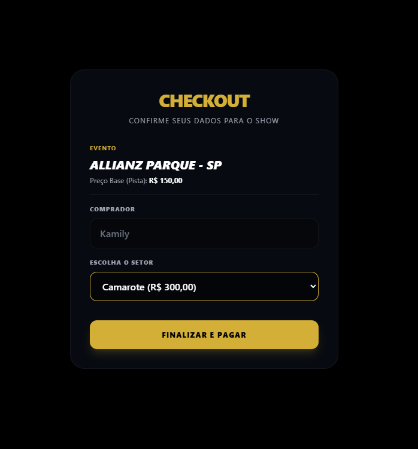
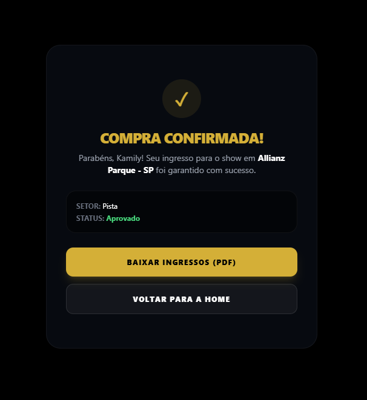
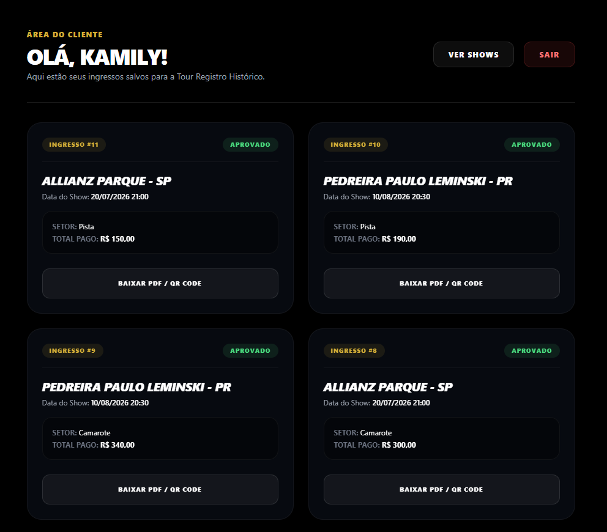
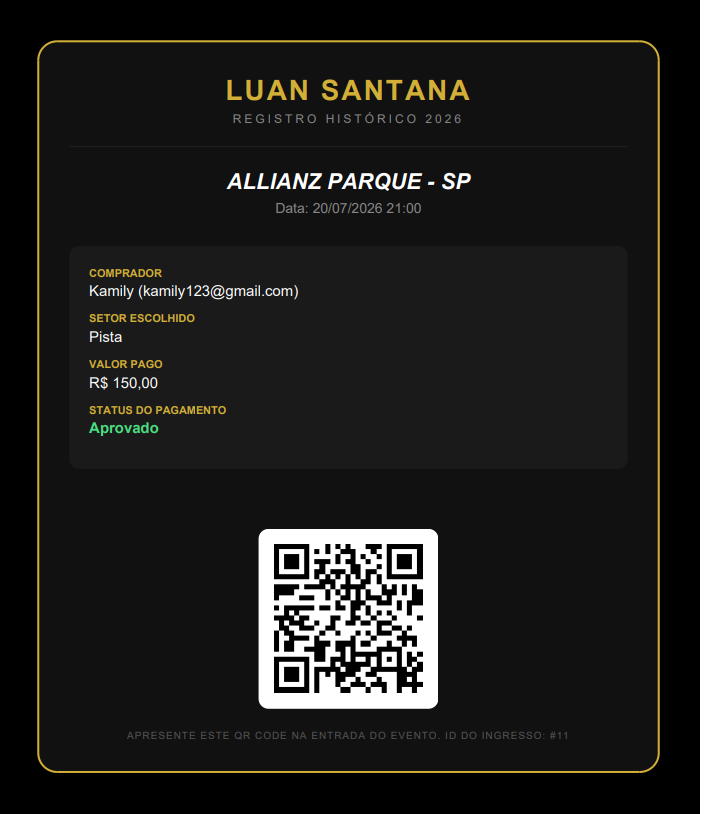

# 🎟️ Sistema de Bilheteria - Tour Registro Histórico (Luan Santana)

Este é um sistema completo de gestão, compra e emissão de ingressos desenvolvido para consolidar conceitos de desenvolvimento web, arquitetura de banco de dados relacional e integração de bibliotecas no back-end. 

A plataforma conta com um fluxo dinâmico de autenticação, controle de sessões, cálculo automatizado de valores por setor (Pista vs. Camarote) e geração de comprovantes legítimos em PDF contendo QR Code exclusivo.

---

## 🛠️ Tecnologias e Ferramentas Utilizadas

* **Back-End:** PHP 8 (utilizando PDO para persistência segura)
* **Banco de Dados:** MySQL / MariaDB (Ambiente XAMPP)
* **Front-End:** HTML5, Tailwind CSS (Design responsivo e tema *Pure Black*)
* **Ícones:** Bootstrap Icons (Componentes visuais e feedbacks de interface)
* **Bibliotecas & APIs:** Dompdf (Conversão de HTML para PDF), API GoQR (Geração dinâmica de QR Codes)
* **Controle de Versão:** Git e GitHub

---

## 🚀 Principais Funcionalidades

1. **Autenticação Segura:** Sistema de login e cadastro de usuários com persistência de dados em sessão (`$_SESSION`), alterando dinamicamente os componentes e a navegação do site.
2. **Regras de Negócio no Checkout:** Processamento automático do valor total do ingresso dependendo do setor escolhido pelo cliente antes de salvar a compra.
3. **Painel do Cliente ("Meus Ingressos"):** Área exclusiva para o usuário logado consultar o histórico de todas as suas compras em tempo real.
4. **Geração Automática de Ingressos:** Renderização de um arquivo PDF estilizado, processando dados do banco e integrando um QR Code exclusivo para validação na entrada do evento.

---

## 📱 Interface do Sistema (Responsiva)

### 1. Página Inicial (Menu Dinâmico)
O cabeçalho identifica se o usuário possui uma sessão activa. Caso esteja logado, exibe saudações personalizadas e links de gerenciamento.

### 2. Fluxo de Compra e Confirmação
O checkout recebe os dados do banco e permite a seleção do setor com atualização de preços. Ao finalizar, o usuário é direcionado para a tela de sucesso.

| Tela de Checkout | Confirmação de Compra |
| :---: | :---: | 
|  |  |

### 3. Painel de Ingressos e Comprovante Final (PDF)
O histórico exibe todos os ingressos gerados. Ao clicar na ação, o back-end processa o Dompdf e entrega o ingresso com QR Code pronto para impressão ou leitura digital.

| Área "Meus Ingressos" | Ingresso Oficial em PDF |
| :---: | :---: |
|  |  |

---

## 🗄️ Modelagem do Banco de Dados

O banco de dados relacional foi modelado no MySQL para garantir a integridade referencial através do uso de Chaves Estrangeiras (`Foreign Keys`).

* **`usuarios`**: Registra dados cadastrais (Nome, E-mail, Senha).
* **`eventos`**: Centraliza os shows disponíveis da tour (Local, Data, Preço Base).
* **`ingressos`**: Tabela pivot que relaciona o usuário ao show comprado, guardando o setor escolhido, valor final pago e data da transação.

> 💡 *Nota: O script estrutural para criação das tabelas e relacionamentos está disponível no arquivo `banco.sql` na raiz deste repositório.*

---

## ⚙️ Como Executar o Projeto Localmente

1. Certifique-se de ter o **XAMPP** instalado (com PHP 8.x).
2. Clone este repositório dentro da sua pasta `xampp/htdocs/`.
3. Ative a extensão **GD** no seu arquivo `php.ini` do XAMPP (removendo o `;` da linha `extension=gd`) e reinicie o Apache.
4. Importe o arquivo `banco.sql` no seu `phpMyAdmin`.
5. Acesse no seu navegador: `http://localhost/projeto_luan/index.php`.